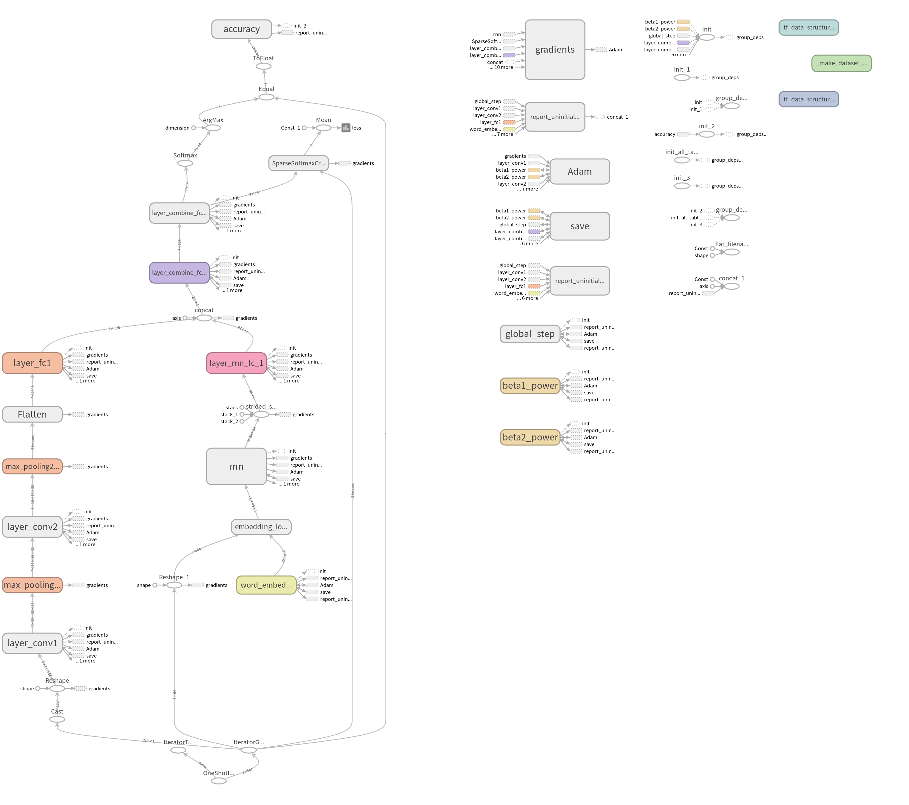

# HTTPS流量识别项目

## 特征提取工具
- AW.Moore等人提出了200多种特征，并提供了特征提取的工具`Discriminators for use in flow-based classification∗`
<a href="https://www.cl.cam.ac.uk/research/srg/netos/projects/archive/nprobe/data/papers/sigmetrics/index.html">Moore提供的超强工具</a> 
- splitcap
- scapy

## 模型架构

## TODO-LIST
- packet数目的选择 
- 每一个packet size长度的选择
- 一维卷积或者二维卷积比较
- 784卷积和我的模型进行比较(模型迁移)
- 在公共的数据集上进行fine-tune(数据迁移)
- 各种模型参数的寻找(cnn大小,embedding大小,batch的大小)